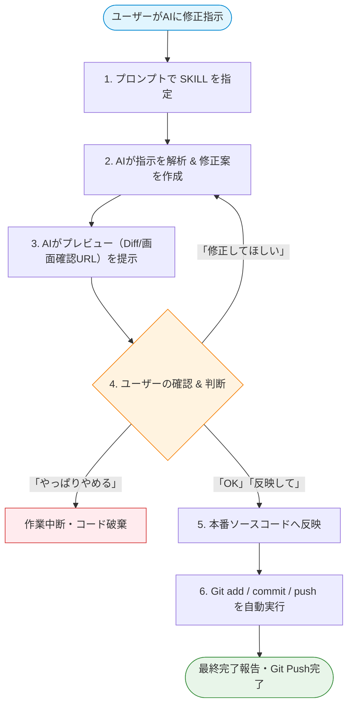

# 復縁屋さん コーポレートHP

心理学・データに基づく復縁サポートのコーポレートサイト。落ち着いた（アイボリー×濃紺×ボルドー）デザインの静的サイトです。ビルド不要ですが、事例・コラムなどのSEOページは **データ駆動で自動生成** します。

## 構成

```
fukuenyasan-hp/
├── index.html            トップページ（手書き。ヒーロー〜無料診断訴求〜事例導線〜FAQ）
├── data/
│   └── site-data.json    ★コンテンツの源泉（事例・コラム・カテゴリ）
├── assets/
│   ├── css/site.css      デザインシステム
│   ├── js/site.js         ヘッダー/ハンバーガー/表示演出
│   └── js/render.js      ★ページ生成の共通ロジック（Node と管理画面で共有）
├── tools/
│   └── generate.cjs      ★静的ページ生成スクリプト
├── admin/
│   └── index.html        ★管理画面（ブラウザ上で編集→再生成）
├── case/ column/ region/ situation/ gender/ partner/   ← 自動生成される
├── sitemap.xml / robots.txt                            ← 自動生成される
```

`case/` `column/` `region/` `situation/` `gender/` `partner/` 配下の HTML と
`sitemap.xml` / `robots.txt` は **生成物** です。手で編集せず、`data/site-data.json`
を変更して再生成してください。トップページ `index.html` だけは手書きです。

## コンテンツの追加・編集（2通り）

### A. 管理画面から（おすすめ・Chrome / Edge）

1. サイトをローカル配信： リポジトリのルートで `npx http-server . -p 8125 -c-1`
2. ブラウザで `http://localhost:8125/fukuenyasan-hp/admin/` を開く
3. 「サイトフォルダを開く」で `fukuenyasan-hp` フォルダを選択
4. 事例・コラムをフォームで追加/編集（カテゴリ設定タブで地域・状況などの選択肢も増やせる）
5. 「公開（全ページ再生成）」で `data/site-data.json` の保存と全HTMLの再生成が完了

> Chrome/Edge 以外では自動書き込みができないため、`site-data.json` をダウンロードし、
> 手動で `data/` に上書き → 下記 B のコマンドで再生成してください。

### B. コマンドから

`data/site-data.json` を直接編集し、以下を実行：

```
node tools/generate.cjs
```

65ページ + sitemap.xml + robots.txt が再生成されます。

## AI開発・修正ワークフロー（Preview-First SKILL 活用マニュアル）

AIアシスタントにコード修正を依頼する際、**「修正案の提示 → プレビュー確認 → ユーザーの承認 → ソースコード反映 & Git Push」** を安全かつ確実に行うための標準フローです。

### ワークフロー図



### AIへの指示の出し方（コピペ用プロンプト）

AIに修正作業を依頼するときは、以下の文面をチャットに貼り付けて指示してください：

```text
`preview-first-workflow` スキルに従って作業を行ってください。
直接ファイルを編集せず、まずプレビュー（修正案やDiff）を見せてください。
私が「OK」を出したら本番ファイルへ反映し、GitにCommit & Pushしてください。

【修正依頼内容】
・（例: ヘッダーのボタンの文言を「今すぐ無料相談」に変更したい）
・（例: 料金ページのテキストを月々6,300円〜に差し替えてほしい）
```

### ユーザーの返答パターン
AIからプレビュー（修正案）が提示されたら、以下のいずれかで返信します：
- **① 承認（OK）**: 「OK！これで反映して」「問題ないです、Git Pushまでお願いします」
- **② 修正・再調整**: 「ボタンの文字サイズをもう少し大きくして」「背景色はもう少し薄くできる？」
- **③ キャンセル**: 「今回は一旦キャンセルで」「変更を取り消してください」

## SEOの設計

- 事例は **性別 / 地域 / 状況 / 相手のタイプ** でタグ付けし、各軸のハブページ（`region/` 等）に自動集約。
- 各ページに `<title>` / meta description / OGP / パンくず（BreadcrumbList）/ Article 構造化データを付与。
- 文言は結果非保証・断定/最上級なしのポリシーを徹底（事例には「個人が特定されないよう変更・結果非保証」の注記を自動付与）。

## デプロイ時の注意

- `tools/generate.cjs` と `admin/index.html` 内の `SITE_URL`（既定 `https://fukuenyasan.jp/`）を本番URLに合わせて調整。
- フォーム送信先はLPの `../fukuenyasan-lp/api/mail.php` を共用（HP単独配信時は別途バックエンドが必要）。
- 診断ツールはLPの `../fukuenyasan-lp/diagnosis.html`（12问）へ誘導。
