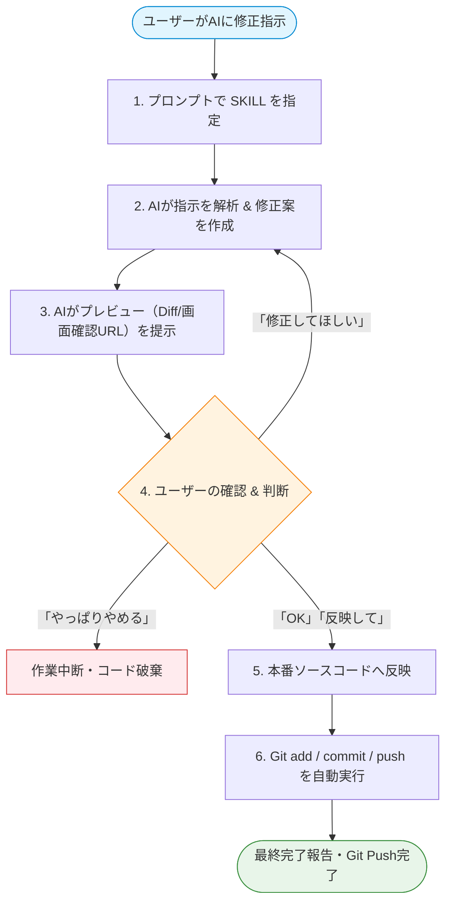

# 📘 【手順書】Preview-First ワークフロー & SKILL 活用マニュアル

このドキュメントは、AIアシスタントにコード修正を依頼する際に、**「修正案の提示 → プレビュー確認 → ユーザーの承認 → ソースコード反映 & Git Push」** を安全かつ確実に行うための標準手順書です。

---

## 📑 目次
1. [全体ワークフロー図](#1-全体ワークフロー図)
2. [AIへの指示の出し方（プロンプトテンプレート）](#2-aiへの指示の出し方プロンプトテンプレート)
3. [ユーザーの返答パターンと流れ](#3-ユーザーの返答パターンと流れ)
4. [実践ステップとやり取りの具体例](#4-実践ステップとやり取りの具体例)
5. [トラブルシューティング & コツ](#5-トラブルシューティング--コツ)

---

## 1. 全体ワークフロー図



---

## 2. AIへの指示の出し方（プロンプトテンプレート）

### 🔹 初回指示（作業スタート時）
AIに作業を依頼する際、**`preview-first-workflow` スキルを使用するよう明示**します。

#### コピペ用テンプレート：
```text
`preview-first-workflow` スキルに従って作業を行ってください。
直接ファイルを編集せず、まずプレビュー（修正案やDiff）を見せてください。
私が「OK」を出したら本番ファイルへ反映し、GitにCommit & Pushしてください。

【修正依頼内容】
・（例: トップページのヘッダーボタンの色をピンクからゴールドに変更したい）
・（例: 料金ページのテキストを月々6,300円〜に差し替えてほしい）
```

---

## 3. ユーザーの返答パターンと流れ

AIからプレビュー（修正案や変更差分）が提示されたら、以下のいずれかの返答を行います。

| 返答パターン | ユーザーの発言例 | AIの動作 |
|---|---|---|
| **① 承認（OK）** | 「OK！これで反映して」「問題ないです、Git Pushまでお願いします」 | 実際のコードを書き換え、`git add / commit / push` を実行して完了報告します。 |
| **② 修正・再調整** | 「ボタンの文字サイズをもう少し大きくして」「背景色はもう少し薄くできる？」 | 指摘を取り入れた修正案を再作成し、再度プレビューを提示します。 |
| **③ キャンセル** | 「今回は一旦キャンセルで」「変更を取り消してください」 | 本番ファイルを一切変更せずに作業を終了します。 |

---

## 4. 実践ステップとやり取りの具体例

### 【シナリオ例：トップページのヘッダー文言を変更したい場合】

#### Step 1: ユーザーからAIへの指示
> **ユーザー**:  
> 「`preview-first-workflow` スキルを使ってヘッダーのボタン文言を『無料相談』から『今すぐ無料相談』に変更してください。まずプレビューを見せてね。」

#### Step 2: AIからのプレビュー提示
> **AI**:  
> 「修正案を作成いたしました！本番ファイルへ反映する前にプレビューをご確認ください。  
> **【変更対象】**: `index.html` (L53)  
> **【変更内容】**:  
> `- <a href="..." class="btn-header">無料相談はこちら</a>`  
> `+ <a href="..." class="btn-header">今すぐ無料相談</a>`  
>   
> こちらの修正内容でよろしければ『OK』とお知らせください。本番反映とGit Pushを行います。」

#### Step 3: ユーザーの確認・OK
> **ユーザー**:  
> 「OK！これで進めてください。」

#### Step 4: AIによる本番反映 & Git Push
> **AI**:  
> 「ご承認ありがとうございます！  
> 1. `index.html` に修正を適用しました。  
> 2. `git add`, `git commit -m "fix: Update header CTA label"`, `git push` を完了いたしました。」

---

## 5. トラブルシューティング & コツ

- **Q. AIが勝手にファイルを書き換えてしまったら？**  
  → 「`preview-first-workflow` のルールを守って、必ず事前にプレビューを提示してください」と伝えてください。
- **Q. チームの他のメンバーもこの手順を使える？**  
  → 本リポジトリの `.gemini/skills/preview-first-workflow/SKILL.md` にスキルが保管されているため、この手順書（`docs/PREVIEW_FIRST_WORKFLOW_MANUAL.md`）を共有すれば誰でも同じフローで利用できます！
